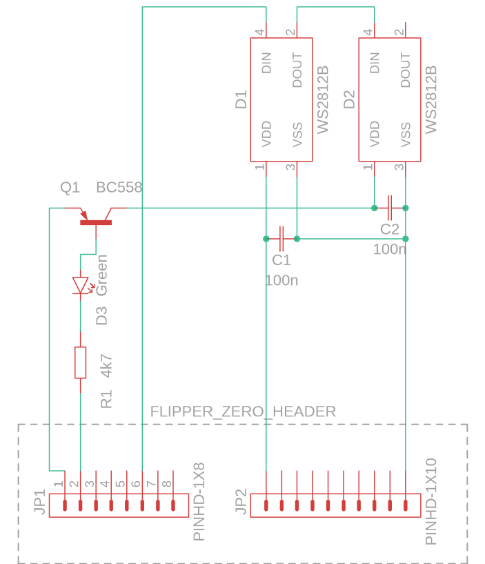
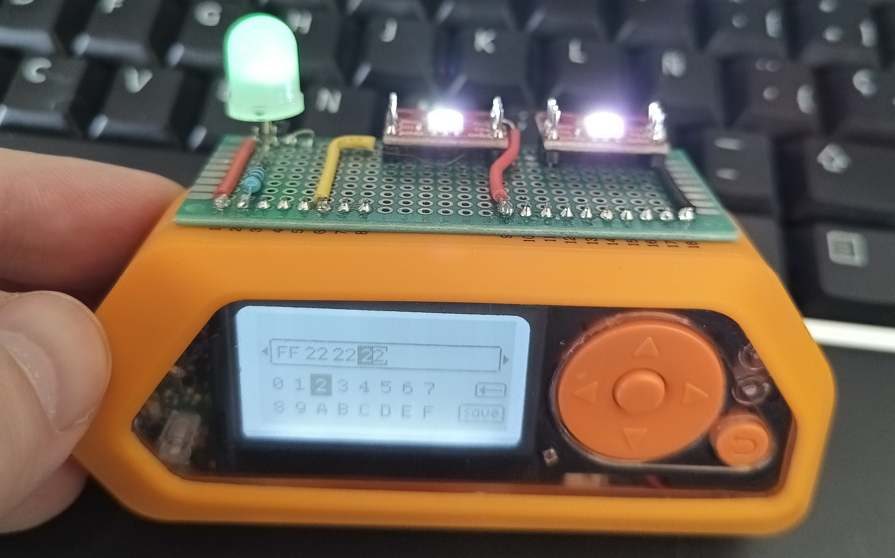

# AVS 2026 Flipper Zero Demo application for RGB LED colour shift and what we can do about it

This is a supplementary demo application for 'Managing color accuracy in next-generation displays: a human-centered, future-proof approach', presented on the 20th of May, on the 'Applied Vision Science (AVS) 2026', conference, St. Pete's Beach Florida, presented by Dr. Zoltan Derzsi and Prof. Robert Volcic.

## Why

When working with displays, the performance description metrics are inherited from older technologies, such as film projection and cathode-ray tube (CRT) displays. Even nowadays, other, newer display technologies are 'calibrated' as if they were CRTs exhibiting triode characterisitics - $L_{OUT} = A\times D_{IN}^{\gamma}$, where $L_{OUT}$ is the luminance output, $D_{IN}$ is the digital value scale of the display output shade, $A$ is just an amplification factor that describes how bright the display is, and $\gamma$ is an exponent that ideally makes the output luminance levels match with human perception so that a unit jump in $D_{IN}$ would result in the same unit jump in the human observer's perceived brightness. Back then when CRTs were used, we had the lucky coincidence that the triode characteristics _roughly_ matched human visual perception - they are both power law relationships, and comparatively minimal adjustments were necessary to achieve a perceptually linear luminance relationship.

However:

* Liquid Crystal Displays have been known to exhibit ion-momentum-orginated luminance non-linearities;
* Mechanical devices such as the Digital Micromirror Device (DMD) suffer from intertia-originated luminance non-linearities
* Light-Emitting Diodes (LEDs) are exponential in nature and degradation is not accounted for
  * Here, while 'silicon-based' and 'organic' LEDs are operating on fundementally different principles, they are treated equally here, as their characteristics can be described with an exponential function (based on Shockley's equation, roughly).

To mitigate these differences, the monitor's display controller is tasked to account and compensate for these linearities - poorly. LCDs and projection systems with DMDs are notoriously difficult to calibrate to achieve perceptual linearity, and with LEDs, especially with discrete LED displays, it is often impossible and not even attempted.
Worse, a previously lesser-known phenomenon in the vision science literature, the LED **luminous efficiency degradation** affects different colours unequally: blue LEDs tend to degrade faster, with distinct and predictable shifts in their characteristics. This results in a **change of linearity** between primary colour channels, which in turn results in a **white-point shift as a function of the luminance output** of the display. In practice, this results as a 'pink shift' when lower brightness values are being used. This phenomenon affects both silicon LEDs and OLEDs, but by different underlying mechanisms - to the observer, the issue is the same

In order to demonstrate this type of LED degradation, this demonstration hardware simulates LED degradation programmatically, so the observers can compare the degraded output against an unaffected output.

### The proposed solution

We propose that the white point stability must be observed for the display at luminance levels in perceptually equivalent steps. This is technically challenging, because while brightness perception does comply with Weber's law, colour vision, being an orthogonal mechanism to brightness perception, does not. Therefore this type of compensation should be applied within the display controller's embedded firmware, based on a mathematical formula to compensate for deterministic degradation.

## The add-on board that attaches to the GPIO header of the Flipper Zero

This is a small board that slots into the header of the Flipper Zero. It contains a custom circuit to demonstrate LED degradation-induced white point shifting, and it is designed to work with an application that is in this repository.

### Hardware

The core part of the board are two individually addressable, WS2812B RGB LED modules. They are connected in a chain: the RGB data is expected to be fed from `PB2`, which is connected to the 'Data In' (`DI`) of the first LED module. The first (left) LED module's 'Data Out' (`DO`) is connected to the second (right) LED module's `DI`.

#### Schematic



#### Implementation

All components were installed on a prototyping board.


The first LED module is powered from the Flipper Zero's 3.3V output directly (red wire on the left). The logic levels coming out from `PB2` (yellow wire) to the WS2812 LED modules are also 3.3V Low-Voltage Transistor-Transistor Logic (LVTTL) compatible.

The second LED's power supply is not sourced from 3.3V - using the 5V output of the Flipper Zero, the 5V power supply (red wire on the right) is being switched via a BC558 PNP transistor. Using high-frequency pulse-width modulation (PWM), the 5V power supply voltage is changed appropriately to keep it at 3.3V for the second LED-module initially.

Since a PNP transistor is used in switching mode, after proper biasing and logic level shifting (in this case, implemented with a 4.7 kOhm resistor and 10 mm Green LED in series), the input is considered 'active low' - meaning that the transistor will only conduct when `PA7` (where the resistor is directly soldered) is logic level 'low'.

Therefore, the duty cycle of the PWM signal coming from `PA7` is inverted.

### Driving the board from software

First, for the second LED module to work, the 5V (also known as 'VSYS') output must be enabled.
Second, `PA7` is configured as an output, the PWM frequency must be set to 50 kHz, and its duty cycle should be set to around ( 1 - ((5-3.3)/5) = ) 66%, which will ensure that the second LED module also gets 3.3V initially. For practical resons, it is set to around 80% instead to show the 'interesting' part.
Third, using Derek Jamison's WS2812 library (`led_driver.c` and `led_driver.h`), we set up to drive two WS2812 LEDs on PB2, with identical RGB values.

In the application, we will control the duty cycle and the RGB value.

## What is happening in this application?

The **user experience** is, let's just say, 'utilitarian': when the hardware is connected to the GPIO header, once the application is launched in `Apps -> Examples -> AVS 2026 LED Demo`, there will be 4 editable bytes on the screen. The first byte controls the power supply for the second LED, and the remaining three bytes are RGB values for both LEDs.

With this, it is possible to demonstrate white-point shifts by simulated degradation-induced LED I-V characterstic changes: by lowering the first byte's value, the second LED will not only get dimmer, but it is becoming distinctly yellow, then eventually red. Since the LED crystals are not _actually_ degraded, changing the colour bytes will result in strange phenomena, such as a completely changed colour shift direction. With changing the RGB values, it is possible to demonstrate the different characteristics of the colour channels - when the colour is red, it can be dimmed a bit further down before noticing apparent brightness changes than with blue.

### Implementation

This section has been split to three subsections, to separate low-level internal and external hardware management, and the high-level GUI management. Since the Flipper Zero actually runs an operating system, allocating and releasing resources (memory, hardware, even some APIs apparently) must be paid proper attention to.

All the 'global' variables are stored in the main application structure, and everything is intertwined. The code snippets included below **DO NOT** reflect this for simplicity and understandability.

Roughly, the main app structure is:

* Allocate memory and initialise the main application context structure with `allocate_things()`
* Initialise hardware (5V power if needed, PWM, and led driver) with `init_hardware()`
* Run the GUI with `run_gui()`, that handles the GUI and the callbacks, which are:
  * At value change, `update_values_from_gui()` gets triggered, which will:
    * Calculate the actual PWM value the output compare hardware needs
    * Does some byte ballet to make sure the RGB values are in the correct order
    * Does the actual hardware updates in the following sequence:
      1. Give full power to the second LED
      2. Set the RGB data for the first and the second LED (they are the same)
      3. Transmit the RGB data
      4. Set the duty cycle to what the user specified
  * When the 'Back' button is pressed on the flipper, two things may happen:
    1. If the `0xPPRRGGBB` byte value was altered, it restores it to `0xFFFFFFFF`, and triggers `update_values_from_gui()`.
    2. If the byte value is already `0xFFFFFFFF`, then it stops the GUI
* Once the GUI is stopped, `stop_hardware()` switches off the LED, the power and puts `PA7` as input for safety
* `free_things()` will gracefully destroy the initialised GUI, power and and LED driver
* Finally, the main context structure is freed, and the application exits.

#### Low-level internal hardware: 5V output, PWM: timers and capture-compare register

The 'furi_hal' API implementation is not quite complete, so we will have to go to register level.

***

For the 5V power on GPIO Pin 1, ether it can be derived directly from USB VBUS (i.e. when charging) or via an internal DC-DC converter, that can be switched on programmatically. However, when using the DC-DC converter, we must consider that it is pretty load-sensitive, so it will take some time for the voltage to build up over 4.5V. If the voltage under load stays below it, the operation will be reported as a failure. So it is totally possible that enabling the power supply will not be successful operation at first, and it will be necessary to hammer on it a couple of times.
In the Flipper Zero firmware, this is references in 'applications/services/power/power_service/power.c,' around lines 222-233. Here, we will adapt Derek Jamison's method to turn on the power:

```C
static void give_me_five_volts()
{
  uint8_t retries = 5;
  while(retries > 0)
  {
    if(furi_hal_power_enable_otg())
    {
      break; // if success, break out of the while loop
    }
    retries--;
  }
}
```

Conversely, when cleaning up, the 5V power should be switched off, it should be checked whether it is indeed on first:

```C
static void turn_off_five_volts()
{
  if(furi_hal_power_is_otg_enabled())
  {
    // if we indeed have power, kill it gracefully.
    furi_hal_power_disable_otg();
  }
}
```

***

The PWM is a different kettle of fish. We have to go low-level ('stm32wbxx_ll_*') on this. `PA7` is related to Timer 1, so we will need to enable it with `furi_hal_bus_enable(FuriHalBusTim1)`. Then, we need to configure the `PA7` pin for 'GpioModeAltFunctionPushPull', and assign TIM1 for it. Then, we set prescaler to 0, the period register (ARR) to 1279, set the duty cycle register (CCR) initially to about 80%, which will be (1280* 0.8 approx) 1024. Then, we set the Output compare module to PWM mode with `LL_TIM_OC_SetMode()`, and enable the 'timer channel' with `LL_TIM_CC_EnableChannel()`. This is a weird one, because `LL_TIM_CHANNEL_CH1` and `LL_TIM_CHANNEL_CH1N` are both valid options, but `LL_TIM_CHANNEL_CH1N` is the correct one. Then we enable the output with `LL_TIM_EnableAllOutputs()`, and finally we set the duty cycle with `LL_TIM_OC_SetCompareCH1()`. The only thing that stands out is this `gpio_pa7`, which is a Flipper-specific structure.

So in practice, there are a couple of parts to this.

```C
#include <furi.h>
#include <furi_hal.h>
#include <furi_hal_gpio.h>
// These are in <firmware>/lib/stm32wb_hal/Inc if you are curious
#include <stm32wbxx_ll_tim.h>
#include <stm32wbxx_ll_gpio.h>
```

First of all, we need to have the Flipper-specific GPIO structure

```C
static const GpioPin gpio_pa7 =
{
  .port = GPIOA,
  .pin = GPIO_PIN_7, // Port A's pin 7
};
```

To set up PWM:

```C
void give_me_pwm()
{
  // Enable the timer bus
  furi_hal_bus_enable(FuriHalBusTIM1);

  // Set PA7: Alternate Function push-pull, assign timer 1
  furi_hal_gpio_init_ex(&gpio_pa7, GpioModeAltFunctionPushPull, GpioPullNo, GpioSpeedVeryHigh, GpioAltFn1TIM1);

  // Now comes the finer things in the PWM world:

  // Set prescaler to 0
  LL_TIM_SetPrescaler(TIM1, 0);

  // Set period register (ARR) to 1279. This controls the PWM frequency to be 50 kHz.
  LL_TIM_SetAutoReload(TIM1, 1279);

  // Set the Output Compare hardware to PWM mode
  LL_TIM_OC_SetMode(TIM1, LL_TIM_CHANNEL_CH1, LL_TIM_OCMODE_PWM1);
  // This was difficult to find.
  LL_TIM_CC_EnableChannel(TIM1, LL_TIM_CHANNEL_CH1N); // Use CH1N for PA7
  // Enable output
  LL_TIM_EnableAllOutputs(TIM1);
  // Set duty cycle (1025/1280 = 80%)
  LL_TIM_OC_SetCompareCH1(TIM1, 1025);

  // Start the counter we tirelessly set up above:
  LL_TIM_EnableCounter(TIM1);

}
```

To adjust PWM, after calling `give_me_pwm()` and assuming nothing is crashed:

```C
void set_pwm(uint32_t duty_cycle)
{
  // Here we assume give_me_pwm() worked and we have proper PWM
  if( (duty_cycle > 0) && (duty_cycle < 1280) )
  {
    // We actually got a valid value
    LL_TIM_OC_SetCompareCH1(TIM1, duty_cycle);
  }
}
```

...and finally, to clean up, we disable the hardware, and to be on the safe side, we set `PA7` as input without the pull-up resistor:

```C
void stop_pwm()
{
  // Here we assume give_me_pwm() worked and we have proper PWM

  // Stop the counter
  LL_TIM_DisableCounter(TIM1);

  // Reconfigure PA7 to be an input so no harm will come to it
  furi_hal_gpio_init_simple(&gpio_pa7, GpioModeInput);

  // We disable the timer HAL bus
  furi_hal_bus_disable(FuriHalBusTIM1);
}
```

#### Low-level external hardware: the WS2812 LED modules

Handling the WS2812 LED is using Derek Jamison's library. [There is a tested and working implementation](https://github.com/jamisonderek/flipper-zero-tutorials/tree/main/gpio/ws2812b_tester) of this code, and there is even a [video on YouTube](https://www.youtube.com/watch?v=oRTIHMNnYZI) available about it. So here we just use the bare minimum because we are only driving two LEDs. Luckily this driver is very well packaged so the implementation is pretty straightforward.

```C
#include "led_driver.h"
```

First of all, we declare the Flipper Zero-specific GPIO structure:

```C
static const GpioPin gpio_pb2 =
{
  .port = GPIOB,
  .pin = GPIO_PIN_2, // Port B's pin 2
};
```

To set up the LEDs, then:

```C

// How many LED modules we have
uint32_t no_of_led_modules = 2;

// Define the colour: 0x00RRGGBB
uint32_t white = 0x00FFFFFF;

// This sets up how many WS2812 LED modules we have, and where they are
static LedDriver* led_driver = led_driver_alloc(no_of_led_modules, &gpio_pb2);
```

To update the colours in the LEDs:

```C
void give_me_colours(LedDriver* led_driver, uint32_t colour)
{

  // Set both LEDs as white
  led_driver_set_led(led_driver, 0, white);
  led_driver_set_led(led_driver, 1, white);

  // This sends out the impulses to the LED modules
  led_driver_transmit(led_driver);

}
```

To clean up:

```C

void stop_led(LEDDriver* led_driver)
{
  // Assuming that the driver is properly initialised and working

  // Turn things off first.
  led_driver_set_led(led_driver, 0, 0x000000);
  led_driver_set_led(led_driver, 1, 0x000000);

  // This sends out the impulses to the LED modules.
  led_driver_transmit(led_driver);

  led_driver_free(led_driver);

  // ...and ideally, make the led driver pointer to NULL
}
```

#### High level GUI - ViewDispatcher, ByteInput, endianness and callback structure

This being a demo application, luckily not much GUI stuff is needed - no need for a menu or additional information, as this is part of a larger presentation. This makes the entire application much simpler.

Here, we use ViewDispatcher with a single view: `ByteInput`. It adjusts a 32-bit unsigned integer in byte-level using hexadecimal numbers.

* The first byte is for adjusting the PWM duty cycle
* The subsequent bytes are the R-G-B colour data to be sent to the LEDs.

In addition to the usual navigation, every value change and clicking the 'save' button invokes the same callback, which updates the 32-bit unsigned integer from the GUI, and subsequently then it updates the WS2812 LED data and the PWM duty cycle.

The devil is in the details though - while the format in the GUI is `0xPPRRGGBB`, with `PP` being the PWM value, ByteInput uses the 32-bit unsigned integer as a 4-byte array. Because of this, the actual value has **little endian** format, so it is actually `0xBBGGRRPP`. This discrepancy is addressed in the callback function. This is the 'some byte ballet' from above:

```C
// The byte input value is 0xBBGGRRPP, we want to convert this to 0x00RRGGBB for the LED driver.
// Take the red byte, shift it left by 8 bits.
// Take the green byte, shift it right by 8 bits.
// Take the blue byte, shift it right by 24 bits.
uint32_t rgb_value_from_gui = ((app_context->byte_input_value & 0x0000FF00) << 8) | ((app_context->byte_input_value & 0x00FF0000) >> 8) | ((app_context->byte_input_value & 0xFF000000) >> 24);
```

Pressing the 'Back' button once restores the 32-bit unsigned integer to its default value: `0xFFFFFFFF`. If it already is at this default value, then it initiates cleanup and exits the application.

Note that while the duty cycle value used here is 1 byte - 256 values, the _actual_ duty cycle value is encoded as an unsigned 32-bit integer, with any value from 0 to 1280, but the direction is inverted because the PWM input on the demo board is **active low**: 0 is the brightest, and 1280 is the dimmest.

In the GUI, we don't want the user to notice this, so the first byte would work as `0xFF` being the brightest, and `0x00` being the dimmest.

...and as an additional twist, because we know that we want to dim between 3.3V and 0V, and the input is 5V, only the top third-is of the PWM values are the interesting ones for the purpose of the demonstration.

Therefore, we would not want to scale 256-level resolution to fit the entire PWM range, but rather, adjust this top third range: 0xFF would correspond to the PWM value of 1022, and 0x00 would correspond to the value of 1277. It was experimentally found out that these WS2812 LED modules will not work when there is valid data on the bus and being powered on, so some _minimal_ power always remains applied to the second LED.

Since we derive the values from the GUI, extracting and calculating the PWM value involves the following steps

* Take the last byte of the 32-bit integer (with bitwise AND with `0x000000FF`)
* Subtract its value from 255, making sure it stays as a 32-bit unsigned integer to invert its effect
* Add this value to to a base value of 1022 and let this be the new CCR value in `LL_TIM_OC_SetCompareCH1()`

Additionally, for the duration of sending out the data, the second LED receives full power, irrespective of what the user set it to. While this results in flashing, but it's better than risking the second LED receiving corrupted data due to brown-out from low power supply voltage.

#### GUI setup and cleanup sequence

Allocation sequence:

* GUI with `furi_record_open(RECORD_GUI)`
* ViewDispatcher with `view_dispatcher_alloc()`
* ByteInput with `byte_input_alloc()`

Then, the application hangs around `run_gui()`, until the user exits the application. Continuing the sequence:

* Attach ViewDispatcher to GUI with `view_dispatcher_attach_to_gui()`
* Set navigation callback for handling the 'Back' button on the Flipper with `view_dispatcher_set_navigation_event_callback()`
* 'Get' the ByteInput view with `byte_input_get_view()`
* Add the view to ViewDispatcher with `view_dispatcher_add_view()`
* Add the value change and 'save button' callback with `byte_input_set_result_callback()`
* Set ByteInput to be the 'active' one with `view_dispatcher_switch_to_view()`

...and finally...

* `view_dispatcher_run()`

Once the user decided to exit the application, the GUI resources must be freed. This is done in the following sequence:

* Stop ViewDispatcher with `view_dispatcher_stop()` (this should have already been called, but just in case)
* Remove the assigned ByteInput view with `view_dispatcher_remove_view()`
* Destroy ByteInput with `byte_input_free()`
* Destroy ViewDispatcher with `view_dispatcher_free()`
* Stop GUI with `furi_record_close(RECORD_GUI)`

### Inter-function communication

Luckily, due to the simplicity of the application, there is no need for MUTEX-es or anything fancy. Because this is a Flipper Zero application, **there are no global variables** in the traditional sense, everything is shoved into a common _context_ structure. This is to make sure that only the allocated memory is being used. If the application attempts to do anything outside its allocated memory, the RTOS running on the Flipper will make it crash and the device reboot. With `view_dispatcher_set_navigation_event_callback()` that calls `back_button_navigation_event()`, it only passes the `view_dispatcher` structure as an input argument. But, since this callback also handles variables in the main context structure, a static pointer is declared in the main function and we use it to access it.
